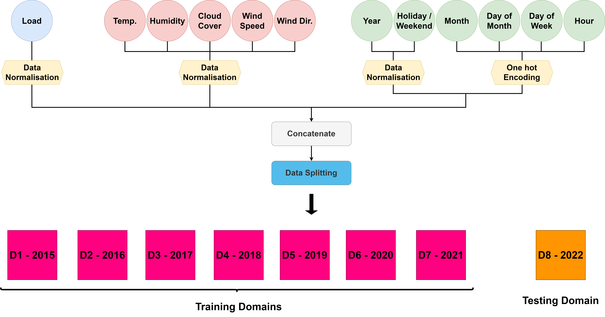

# DRINOT
DRift-Aware dynamIc neural Network by integrating a Temporal convolutional network (TCN) and incorporating drOpout for Load forecasting. 
Flowchart of Data preprocessing techniques in DRAONT model: 
<be>
 
 

