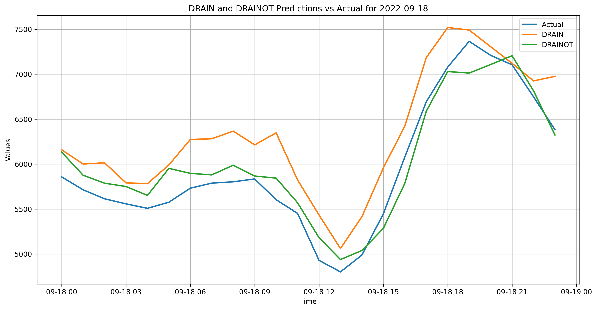
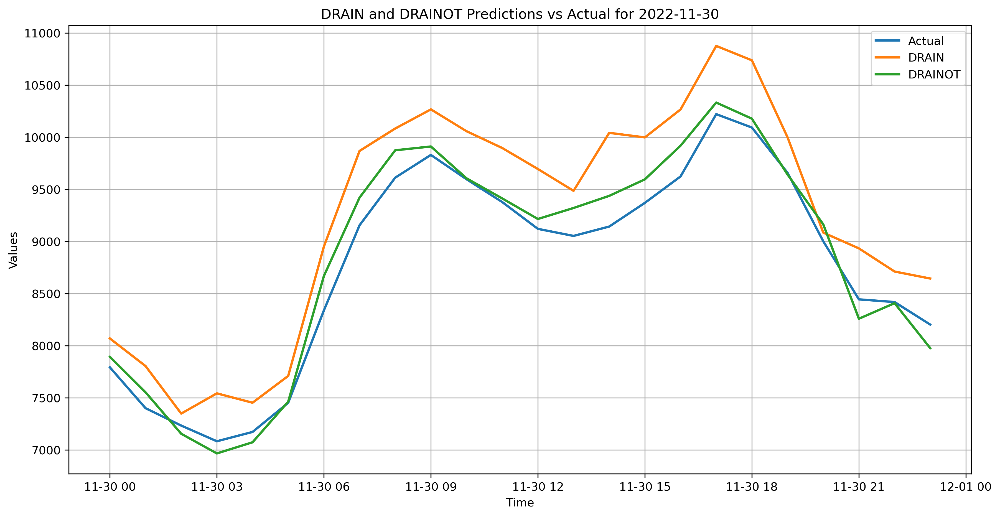

# DRAINOT
DRift-Aware dynamIc neural Network by integrating a Temporal convolutional network (TCN) and incorporating drOpout for Load forecasting. 
 
Flowchart of Data preprocessing techniques in the DRAINOT model: 
 
 
 

<be>
<be>
The DRAINOT model is compared to DRAIN and actual data for random days for different datasets.

Elia Data:

