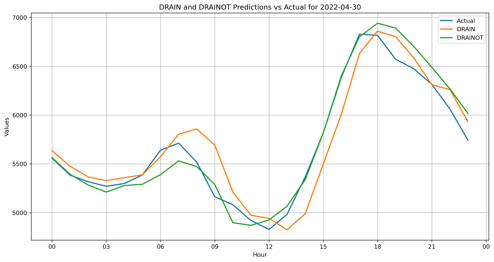

# Supplementary Figures for "Drift-Aware Dynamic Neural Network for Improving Short-term Load Forecasting"

This repository contains supplementary figures and materials for the paper titled "Drift-Aware Dynamic Neural Network for Improving Short-term Load Forecasting," will be presented at the IEEE Conference SEST 2024.

## Repository Contents

### Flowchart
- **Flowchart_Data_Preprocessing.png**: A detailed flowchart illustrating the data preprocessing steps used in the study.

### Time Series Visualizations
We have chosen two random days for each location to illustrate the load forecasting results.

- **NSW**
  - **NSW_Predictions_2022-02-11.png**: Time series visualization of the load forecasting results for New South Wales on February 11, 2022.
  - **NSW_Predictions_2022-10-21.png**: Time series visualization of the load forecasting results for New South Wales on October 21, 2022.
- **VIC**
  - **VIC_Predictions_2022-03-06.png**: Time series visualization of the load forecasting results for Victoria on March 6, 2022.
  - **VIC_Predictions_2022-11-28.png**: Time series visualization of the load forecasting results for Victoria on November 28, 2022.
- **QLD**
  - **QLD_Predictions_2022-02-04.png**: Time series visualization of the load forecasting results for Queensland on February 4, 2022.
  - **QLD_Predictions_2022-04-30.png**: Time series visualization of the load forecasting results for Queensland on April 30, 2022.
- **SA**
  - **SA_Predictions_2022-01-18.png**: Time series visualization of the load forecasting results for South Australia on January 18, 2022.
  - **SA_Predictions_2022-12-24.png**: Time series visualization of the load forecasting results for South Australia on December 24, 2022.
- **Belgium**
  - **ELIA_Predictions_2022-09-18.png**: Time series visualization of the load forecasting results for Belgium on September 18, 2022.
  - **ELIA_Predictions_2022-11-30.png**: Time series visualization of the load forecasting results for Belgium on November 30, 2022.

## Description of Figures

### Flowchart of Data Preprocessing

- **Filename**: `dataprocessing.png`
- **Description**: This figure provides a comprehensive overview of the data preprocessing steps, including data normalization, merging load data with weather and holiday information, and splitting the dataset into training and testing sets.

### Time Series Visualizations

#### New South Wales (NSW)

- **Filename**: `NSW_Predictions_2022-02-11.png`
- **Description**: Time series visualization of the load forecasting results for NSW on February 11, 2022.

- **Filename**: `NSW_Predictions_2022-10-21.png`
- **Description**: Time series visualization of the load forecasting results for NSW on October 21, 2022.

#### Victoria (VIC)

- **Filename**: `VIC_Predictions_2022-03-06.png`
- **Description**: Time series visualization of the load forecasting results for VIC on March 6, 2022.

- **Filename**: `VIC_Predictions_2022-11-28.png`
- **Description**: Time series visualization of the load forecasting results for VIC on November 28, 2022.

#### Queensland (QLD)

- **Filename**: `QLD_Predictions_2022-02-04.png`
- **Description**: Time series visualization of the load forecasting results for QLD on February 4, 2022.

- **Filename**: `QLD_Predictions_2022-04-30.png`
- **Description**: Time series visualization of the load forecasting results for QLD on April 30, 2022.

#### South Australia (SA)

- **Filename**: `SA_Predictions_2022-01-18.png`
- **Description**: Time series visualization of the load forecasting results for SA on January 18, 2022.

- **Filename**: `SA_Predictions_2022-12-24.png`
- **Description**: Time series visualization of the load forecasting results for SA on December 24, 2022.

#### Belgium

- **Filename**: `ELIA_Predictions_2022-09-18.png`
- **Description**: Time series visualization of the load forecasting results for Belgium on September 18, 2022.

- **Filename**: `ELIA_Predictions_2022-11-30.png`
- **Description**: Time series visualization of the load forecasting results for Belgium on November 30, 2022.

## Contact Information

For any questions or further information, please contact:

- **Name**: Ahmad Ahmad
- **Email**: ahmad.b.ahmad@unsw.edu.au

